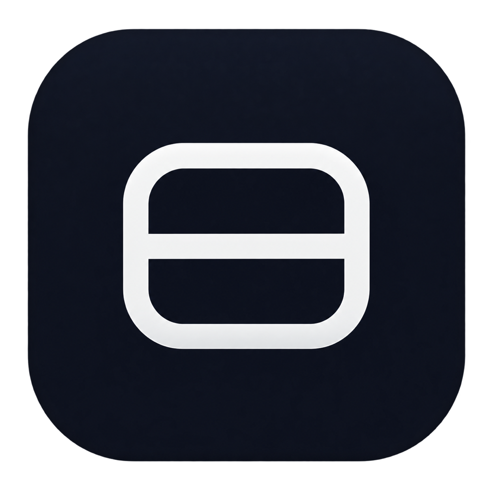

# TuckBar 

<p align="center">
  
</p>

<p align="center">
  <b>精美、轻量、可靠的 macOS 菜单栏收纳利器</b><br>
  灵感融合 iBar 与 Ice，专为刘海屏及多图标用户量身打造。
</p>

<p align="center">
  
  
  
  
</p>

---

## 🌟 为什么选择 TuckBar？

当菜单栏常驻应用越来越多，尤其在搭载 **刘海屏（Notch）** 的 MacBook 上，过多的图标常常被系统无情遮挡甚至“吞掉”。

**TuckBar** 致力于解决这一核心痛点：
- **两套核心展现形态**：支持 **「原生菜单栏展开折叠」** 与 **「第二行紧凑悬浮岛」**，按需随意切换。
- **100% 原生点击保真**：完全调用 macOS 真实菜单栏项目，拒绝死板截图冒充，点击即触发宿主应用的原生菜单与弹窗。
- **丝滑多维交互**：左键轻点、鼠标悬停、菜单栏滚轮/触控板双指滑动，或全局快捷键 `⌥ + B`，随心所欲。
- **三层严谨分区**：支持 **「常显」**、**「收纳」** 与 **「始终隐藏」**，杂乱菜单栏瞬间清爽。
- **100% 绝对隐私安全**：完全本地运行，无网络请求、无遥测数据，所有配置本地保存。

---

## ✨ 核心特性

### 1. 两种展现模式
- **菜单栏折叠模式（推荐）**：点击 TuckBar 图标，直接在顶部菜单栏向左平滑展开隐藏图标，与系统级体验完全融为一体。
- **聚合浮窗模式（刘海屏友好）**：在菜单栏下方弹出半透明毛玻璃胶囊浮岛，1:1 比例展示收纳图标，无惧刘海遮挡。

### 2. 丰富自然的手势与触控反馈
- **多级触觉反馈（Haptics）**：展开时呈现轻快微振（`.levelChange`），收起时呈现干脆回弹（`.alignment`）。
- **滚轮与触控板手势**：鼠标位于菜单栏区域时，向上/向左滚动即可展开，向下/向右滚动即可收起，内置防抖缓冲机制。
- **全局快捷键呼出**：默认支持 `Option + B`（`⌥ B`），在任意全屏或专注场景下一键瞬时呼出。
- **防打扰倒计时**：展开后自动收起倒计时在鼠标停留在菜单栏时会自动保持暂停，绝不误收起。

### 3. 极速直观的布局管理
- **分类筛选标签**：在偏好设置中按【全部】/【常显】/【已收纳】/【始终隐藏】一键过滤。
- **App 运行状态指示灯**：智能检测后台活跃进程，在正在运行的 App 旁点亮精致的翠绿色指示灯。
- **一键批量移入**：初次配置时可点击“全部移入收纳”，免去逐个点击的烦恼。
- **浮窗右键菜单直达**：在浮窗中右键任意图标，即可直接调整其分区或在访达中定位源程序。

---

## 🔒 隐私与系统权限

TuckBar 承诺不收集任何个人数据，无需连网，详情请查阅完整的 [隐私政策 (PRIVACY.md)](PRIVACY.md)。

初次启动时，TuckBar 需要以下两项 macOS 标准权限：
1. **辅助功能 (Accessibility)**：用于识别菜单栏真实项目并执行点击/排序指令。
2. **屏幕录制 (Screen Recording)**：通过 macOS `ScreenCaptureKit` 对菜单栏单个图标进行高保真快照，用于在浮岛与设置列表中以 1:1 高清展示图标（**绝不录制屏幕或保存截图**）。

---

## 🚀 下载与安装

### 预编译版本下载
前往 [Releases 页面](https://github.com/lglglglglg/TuckBar/releases) 下载最新发布的 `TuckBar-0.9.7.zip`，解压后拖入「应用程序（Applications）」文件夹即可运行。

### 本地编译源码
要求环境：macOS 14.0+，Xcode 15+，已安装 [xcodegen](https://github.com/yonaskolb/XcodeGen)。

```bash
# 克隆仓库
git clone https://github.com/lglglglglg/TuckBar.git
cd TuckBar

# 生成 Xcode 工程并编译打包
./scripts/package-stable.sh
```

构建产物将输出至 `dist/TuckBar.app` 与 `dist/TuckBar-0.9.7.zip`。

---

## ⌨️ 常用快捷键与操作

| 动作 | 交互方式 |
| :--- | :--- |
| **展开 / 收起菜单栏** | 单击 TuckBar 图标 / 全局快捷键 `⌥ B` |
| **手势展开 / 收起** | 菜单栏区域滚轮向上/向左滚动展开，向下/向右滚动收起 |
| **临时查看收纳图标** | 鼠标移动到 TuckBar 图标上方悬停（可在设置中开关） |
| **快捷菜单与重新扫描** | 右键点击 TuckBar 图标 |
| **浮窗项快速管理** | 在聚合浮岛中右键任意图标，选择“常显”或“始终隐藏” |
| **偏好设置** | 右键图标选择“偏好设置…”或快捷键 `⌘ ,` |

---

## 📄 开源许可证与署名

- **版权所有**：© 2026 **Stephan Li**（韩十久工作室 · Hanshijiu Studio）
- **开源协议**：本项目基于 [MIT License](LICENSE) 协议开源，欢迎自由交流、使用与衍生开发。

---

## 👨‍💻 创作团队

- **工作室**：韩十久工作室 (Hanshijiu Studio)
- **主理人**：Stephan Li
- **项目仓库**：[https://github.com/lglglglglg/TuckBar](https://github.com/lglglglglg/TuckBar)

欢迎提交 Issue 和 Pull Request，一起把 TuckBar 打造得更加精美完善！
